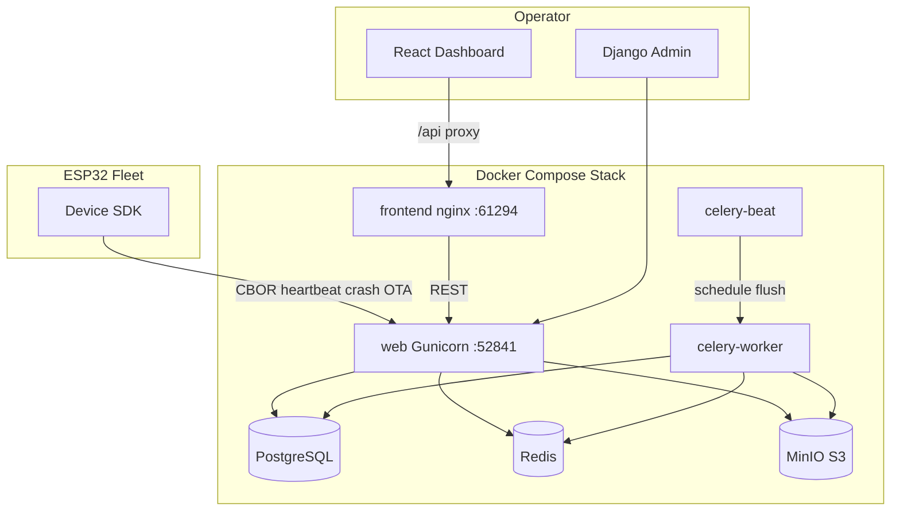
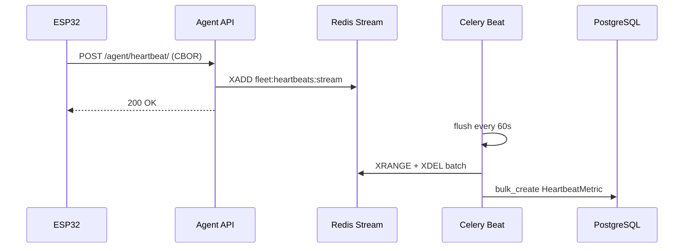
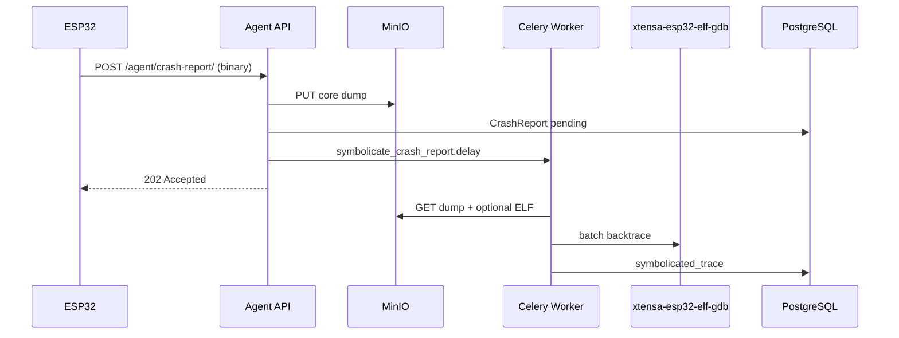
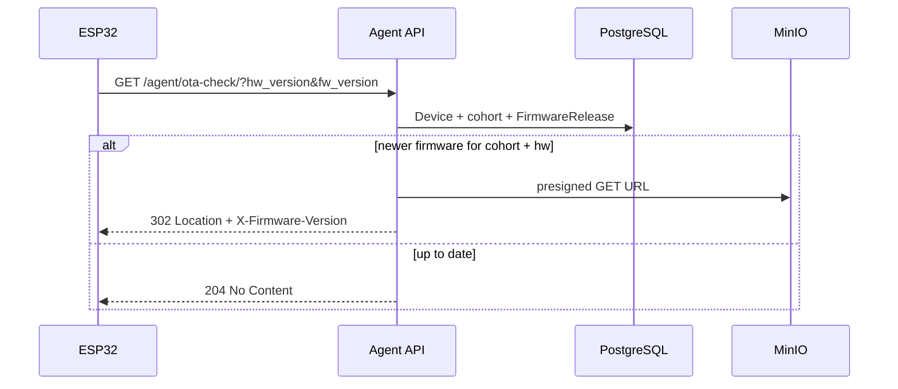
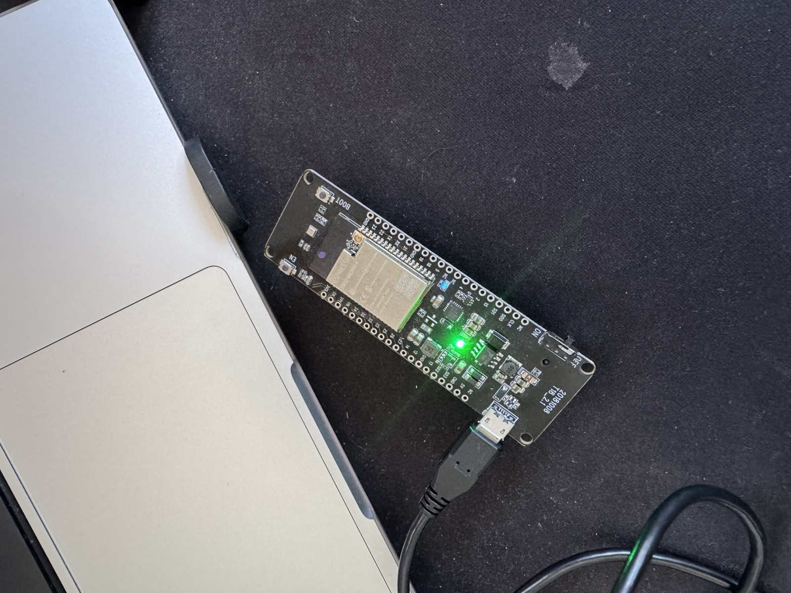
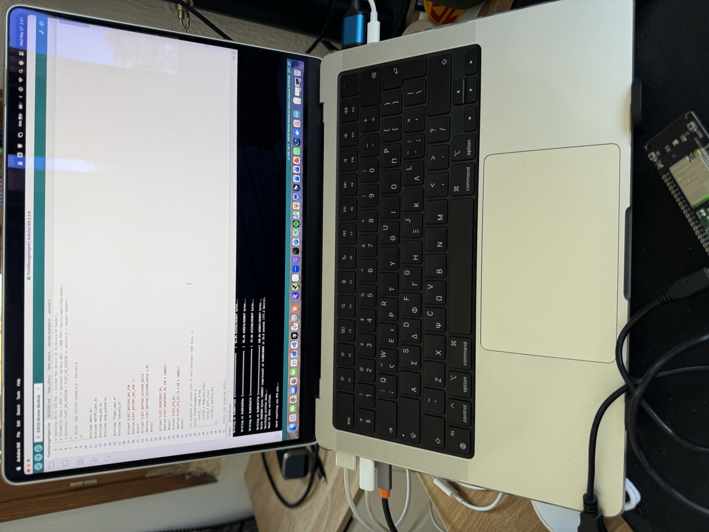
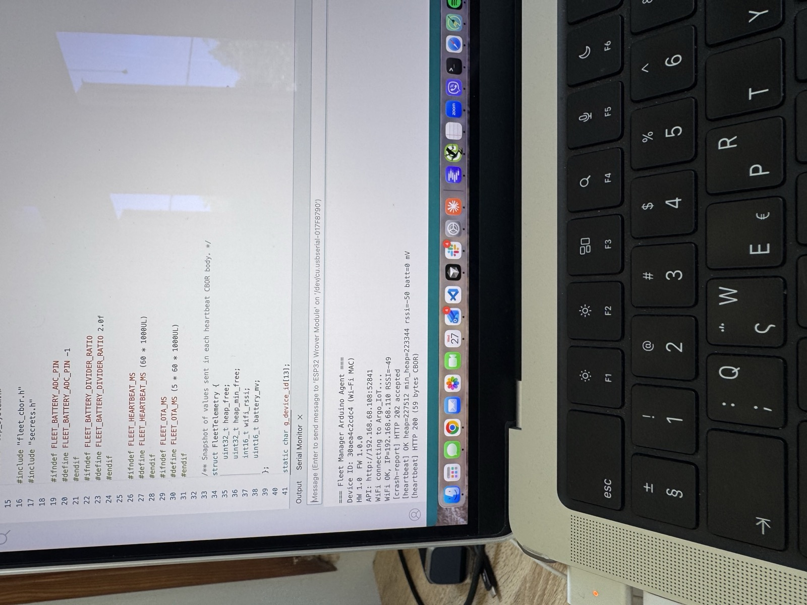
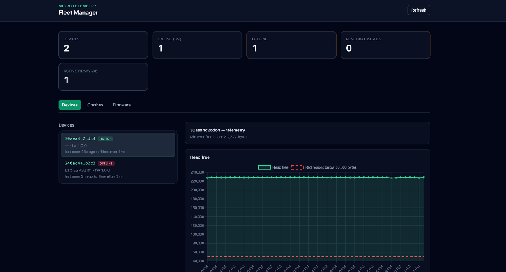
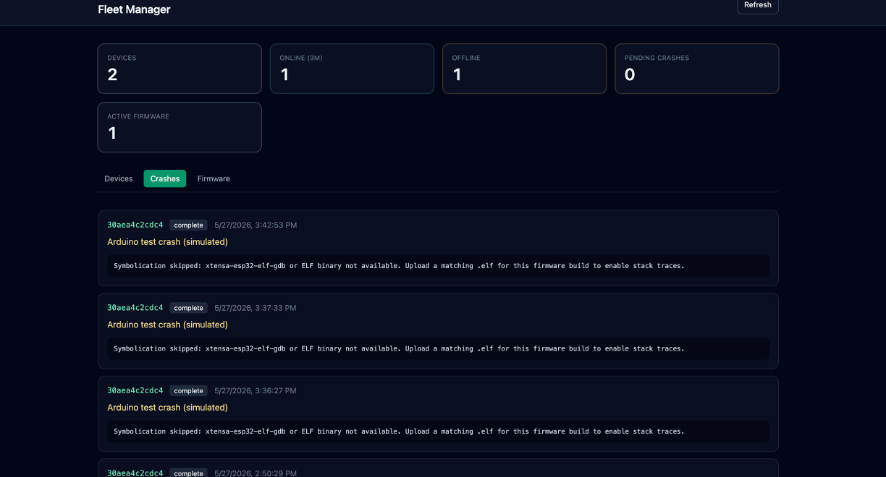
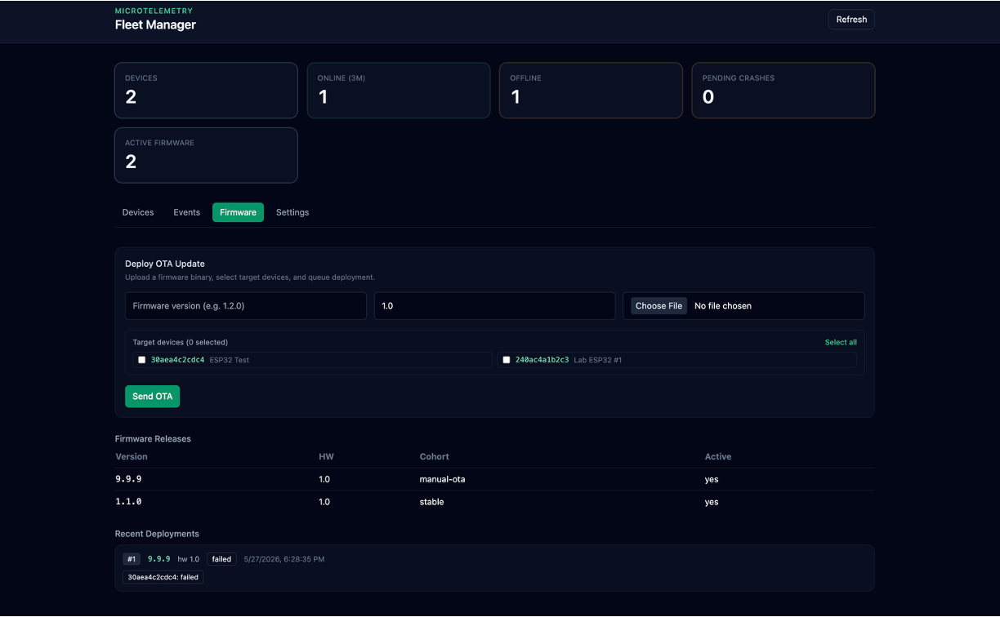

# Fleet Manager (MicroTelemetry)

A lightweight IoT observability and firmware management platform for **ESP32** fleets. It ingests crash dumps, streams device telemetry over **CBOR**, and delivers **OTA** updates via cohort-based rollouts.

Built with **Django 5**, **Celery**, **PostgreSQL**, **Redis**, and **S3-compatible storage** (MinIO locally). A **React** dashboard visualizes fleet health, crashes, and firmware releases.

## Features

| Capability | Agent endpoint | Description |
|------------|----------------|-------------|
| **Crash reports** | `POST /api/v1/agent/crash-report/` | Binary core dump upload → S3 → async `xtensa-esp32-elf-gdb` symbolication |
| **Heartbeats** | `POST /api/v1/agent/heartbeat/` | CBOR metrics (heap, RSSI, battery) buffered in Redis, flushed to Postgres every 60s |
| **OTA pull** | `GET /api/v1/agent/ota-check/` | `302` redirect to a signed firmware URL when a newer build exists for the device cohort |

Devices are identified by their **6-byte factory MAC** as a 12-character lowercase hex string (e.g. `240ac4a1b2c3`).

## Architecture

### System overview

Fleet Manager splits traffic into two planes: an **agent plane** (ESP32 devices, low bandwidth, CBOR/binary) and an **operator plane** (browser dashboard and Django admin).



### Components

| Layer | Technology | Role |
|-------|------------|------|
| **Device SDK** | C / ESP-IDF | Heartbeats (CBOR), crash dump upload, OTA poll via `esp_http_client` |
| **Agent API** | Django (`agents/`) | Device-facing endpoints; returns **503** on DB/storage failure so devices back off |
| **Dashboard API** | DRF (`dashboard/`) | JSON for the React UI — devices, metrics, crashes, firmware, cohorts |
| **Domain** | Django (`fleet/`) | Models, business logic in `fleet/services/`, Celery tasks |
| **Web server** | Gunicorn + WhiteNoise | WSGI app; serves collected static files (admin CSS) when `DEBUG=false` |
| **Task queue** | Celery + Redis | Async symbolication; periodic heartbeat flush from Redis stream → Postgres |
| **Metadata DB** | PostgreSQL | Devices, cohorts, firmware releases, heartbeat rows, crash report metadata |
| **Buffer** | Redis Stream | High-frequency heartbeats land here before bulk insert (default: 60s flush) |
| **Object storage** | MinIO (S3 API) | Core dumps, `.elf` symbols, firmware `.bin` files; presigned URLs for OTA |
| **Frontend** | React + Vite build → nginx | SPA on port **61294**; proxies `/api` and `/admin` to Gunicorn |

### Data flows

#### Heartbeat (telemetry)



Views stay thin: decode CBOR, validate fields, enqueue. No per-packet Postgres write.

#### Crash report (symbolication)



Panic-path firmware must not use `malloc()` or `printf()` — capture registers/stack in RTC/SPIFFS, upload after reboot.

#### OTA pull (cohort rollout)



OTA matching uses **semantic versioning** per `hw_version` and **cohort**. Devices without a cohort never receive an update.

### Domain model

| Model | Purpose |
|-------|---------|
| `Cohort` | Named rollout group (e.g. `stable`, `canary`) |
| `Device` | Primary key = 12-char MAC hex; tracks `hw_version`, `fw_version`, `last_seen_at` |
| `HeartbeatMetric` | Time-series rows: heap, min heap, RSSI, battery (indexed columns, not JSON) |
| `CrashReport` | S3 keys, panic reason, symbolication status/trace |
| `FirmwareRelease` | Version + `hw_version` + cohort + `s3_key` for the binary in object storage |

### Docker topology (production compose)

| Container | Image / build | Notes |
|-----------|---------------|-------|
| `postgres` | `postgres:16-alpine` | Persistent volume `postgres_data` |
| `redis` | `redis:7-alpine` | Celery broker + heartbeat stream |
| `minio` | `minio/minio` | API + console ports exposed on host |
| `minio-init` | `minio/mc` | One-shot: creates `fleet-manager` bucket, then exits |
| `web` | `Dockerfile` → Gunicorn | `migrate` + `collectstatic` on start; WhiteNoise for `/static/` |
| `celery-worker` | same image | Runs `symbolicate_crash_report` and flush tasks |
| `celery-beat` | same image | Schedules heartbeat stream flush (60s default) |
| `frontend` | `frontend/Dockerfile` | Multi-stage: `npm run build` → nginx serves SPA + API proxy |

Internal DNS names (`postgres`, `redis`, `minio`, `web`) are used inside the compose network. Host ports are configurable via `.env` (`WEB_PORT`, `FRONTEND_PORT`, etc.).

### Design principles

- **Thin views, fat services** — request parsing in views; OTA rules, storage, and symbolication in `fleet/services/`.
- **Structured telemetry** — explicit columns on `HeartbeatMetric` for PostgreSQL indexing and partitioning-friendly schemas.
- **Write buffering** — Redis absorbs heartbeat spikes; Celery bulk-writes to Postgres.
- **Fail-safe agents** — storage or DB errors surface as **503**, not opaque 500s, to protect device batteries and flash wear.

## Repository layout

```
fleet_manager/
├── core/                 # Django project (settings, Celery, URLs)
├── fleet/                # Models, services, Celery tasks, migrations
├── agents/               # Device-facing HTTP API
├── dashboard/            # REST API for the web UI
├── frontend/             # React dashboard (Vite dev / Docker nginx prod)
├── firmware/
│   ├── sdk/              # Shared C headers (reference)
│   └── examples/         # Arduino + ESP-IDF ready-to-flash agents
├── images/               # Photos for README (Arduino / ESP32 setup)
├── scripts/              # stop-local.sh, simulate_heartbeat.py
├── docker/               # Gunicorn entrypoint, nginx config for frontend image
├── scripts/              # stop-local.sh — free ports before compose up
├── docker-compose.yml    # Full production stack
├── manage.py
├── requirements.txt
└── README.md
```

## Production stack (Docker)

Requires **Docker Desktop** running.

```bash
# Stop any local runserver / Vite on the same ports
./scripts/stop-local.sh

cp -n .env.example .env   # skip if .env exists
# Ensure .env has DEV_USE_SQLITE=false for Docker

docker compose up --build -d
docker compose exec web python manage.py seed_demo
```

| Service | URL (default host ports) |
|---------|--------------------------|
| Dashboard (nginx + React) | http://localhost:61294 |
| API (Gunicorn) | http://localhost:52841 |
| Django admin | http://localhost:52841/admin/ |
| MinIO API (S3) | http://localhost:38472 |
| MinIO console | http://localhost:41908 |
| Postgres | `localhost:47291` |
| Redis | `localhost:58163` |

**MinIO login** (console at port **41908** — not `admin`):

| Field | Value |
|-------|--------|
| Username | `minioadmin` |
| Password | `minioadmin` |

Django and Celery use the same keys via `.env` (`AWS_ACCESS_KEY_ID` / `AWS_SECRET_ACCESS_KEY`). The `minio-init` container creates the **`fleet-manager`** bucket on first stack start.

Stack: **Gunicorn** (not `runserver`), Postgres, Redis, MinIO, Celery worker + beat, built frontend behind nginx. Host ports are configurable in `.env` to avoid local clashes.

```bash
docker compose logs -f web
docker compose exec web python manage.py createsuperuser
docker compose down
```

## Local development (Django on your machine)

You do **not** need the full `docker compose up` stack, but Django expects backing services unless you use the SQLite shortcut below.

### Option A — Infra only in Docker (recommended)

Run Postgres, Redis, and MinIO in Docker; run Django locally:

```bash
cp .env.example .env
docker compose up postgres redis minio minio-init -d

source .venv/bin/activate   # or: python -m venv .venv && source .venv/bin/activate
pip install -r requirements.txt
python manage.py migrate
python manage.py seed_demo
python manage.py runserver 52841
```

`Connection refused` on port **47291** means Postgres is not running — start it with the `docker compose up postgres ...` line above.

### Option B — No Docker (SQLite only)

Good for admin, dashboard API, and migrations. Agent heartbeats still need Redis; crash uploads need MinIO.

```bash
cp .env.example .env
echo 'DEV_USE_SQLITE=true' >> .env

python manage.py migrate
python manage.py runserver
```

Default dev server URL: http://127.0.0.1:8000/ (not 52841 unless you pass that port).

### Backend (full local stack)

```bash
python -m venv venv
source venv/bin/activate   # Windows: venv\Scripts\activate
pip install -r requirements.txt
cp .env.example .env

# Requires Option A infra, or your own Postgres on the port in DATABASE_URL

python manage.py migrate
python manage.py seed_demo
python manage.py runserver 52841
```

Celery (separate terminals):

```bash
celery -A core worker --loglevel=info
celery -A core beat --loglevel=info
```

### Frontend

```bash
cd frontend
npm install
npm run dev
```

Open http://localhost:61294 — Vite proxies `/api` to Django (`WEB_PORT`, default 52841).

### Tests

```bash
pytest
```

## Test with a real ESP32

Full guides: [`firmware/examples/README.md`](firmware/examples/README.md)

### Arduino (fastest)

```bash
cp firmware/examples/arduino/FleetManagerAgent/secrets.example.h \
   firmware/examples/arduino/FleetManagerAgent/secrets.h
# Edit secrets.h: Wi-Fi + FLEET_API_HOST=<your LAN IP>
```

1. Connect the ESP32 to your computer with USB (power switch **ON**). A WROVER module is shown below; any ESP32 dev board works.

   

2. In [Arduino IDE](https://www.arduino.cc/) 2.x, open `firmware/examples/arduino/FleetManagerAgent/FleetManagerAgent.ino`, select **ESP32 Wrover Module** (or your board), choose the serial port, and click **Upload**.

   

3. Open **Serial Monitor** @ **115200** baud. On success you should see the device ID (Wi‑Fi MAC), API URL, Wi‑Fi join, then heartbeats returning **HTTP 200**.

   

Example output:

```text
=== Fleet Manager Arduino Agent ===
Device ID: 30aea4c2cdc4 (Wi-Fi MAC)
HW 1.0  FW 1.0.0
API: http://192.168.68.108:52841
WiFi OK, IP=192.168.68.110 RSSI=-49
[crash-report] HTTP 202 accepted
[heartbeat] OK heap=227512 min_heap=223344 rssi=-50 batt=0 mV
[heartbeat] HTTP 200 (59 bytes CBOR)
```

More detail: [`firmware/examples/arduino/FleetManagerAgent/README.md`](firmware/examples/arduino/FleetManagerAgent/README.md)

### ESP-IDF / FreeRTOS

```bash
cd firmware/examples/esp-idf/fleet_agent
idf.py set-target esp32
idf.py menuconfig   # Fleet Manager Agent → Wi-Fi + API URL
idf.py -p PORT flash monitor
```

### No hardware (simulate from laptop)

```bash
docker compose up -d
python3 scripts/simulate_heartbeat.py --device-id 240ac4dead01
```

Open http://localhost:61294 — allow ~60s for Redis flush, or check `curl http://localhost:52841/api/v1/dashboard/devices/`.

**Important:** ESP32 must use your PC's **LAN IP** (e.g. `192.168.1.42:52841`), not `127.0.0.1`.

### Platform screenshots

Dashboard views from a local run:





### ESP32 gets HTTP 400 on heartbeat or crash-report

If Serial shows `[heartbeat] HTTP 400` or `[crash-report] HTTP 400` while Wi‑Fi is connected, Django is usually rejecting the **Host** header. The device calls `http://<your-lan-ip>:52841`, so that IP must be listed in `ALLOWED_HOSTS`.

1. Find your machine's LAN IP (macOS: **System Settings → Network**, or `ipconfig getifaddr en0`).
2. Add it to `.env` (comma-separated, no spaces):

   ```bash
   ALLOWED_HOSTS=localhost,127.0.0.1,web,192.168.68.108
   ```

   `.env.example` includes a placeholder IP for this reason.

3. Recreate the web container so the env is picked up:

   ```bash
   docker compose up -d web
   ```

4. Reset the ESP32. You should see `[heartbeat] HTTP 200` and, if test crash is enabled, `[crash-report] HTTP 202`.

A **400** with a short HTML body is typical for `DisallowedHost`. A **400** with JSON like `Missing X-Device-Id` means the host is allowed but headers or CBOR are wrong — check `X-Device-Id` and that `fleet_cbor.h` uses `extern "C"` for Arduino builds.

## Agent API reference

### Heartbeat (CBOR)

```http
POST /api/v1/agent/heartbeat/
Content-Type: application/cbor
X-Device-Id: 240ac4a1b2c3
X-Hw-Version: 1.0
X-Fw-Version: 1.0.0
```

CBOR map fields:

- `heap_free` (uint) — free heap bytes  
- `heap_min_free` (uint) — minimum ever free heap  
- `wifi_rssi` (int) — RSSI in dBm  
- `battery_mv` (uint, optional) — battery voltage in millivolts  
- `cpu_temp_c` (int, optional) — CPU temperature in Celsius  

### Crash report

```http
POST /api/v1/agent/crash-report/
Content-Type: application/octet-stream
X-Device-Id: 240ac4a1b2c3
X-Panic-Reason: Guru Meditation Error: LoadProhibited
X-Elf-S3-Key: firmware/1.0.0/build.elf   # optional, for symbolication
```

Body: raw binary dump. Response `202` with `{ "id", "status": "accepted" }`.

### OTA check

```http
GET /api/v1/agent/ota-check/?device_id=240ac4a1b2c3&hw_version=1.0&fw_version=1.0.0
```

- **204** — no update  
- **302** — `Location` header is a presigned firmware URL; `X-Firmware-Version` header set  

Database or storage failures return **503** so devices back off instead of retrying indefinitely.

## Dashboard API

Base path: `/api/v1/dashboard/`

- `GET /stats/` — fleet summary  
- `GET /devices/` — device list  
- `GET /devices/{device_id}/metrics/` — heartbeat history  
- `GET /crashes/` — crash reports  
- `GET /firmware/` — firmware releases  
- `GET /cohorts/` — rollout cohorts  

Assign devices to cohorts in Django admin, then upload firmware binaries to MinIO and register `FirmwareRelease` rows with matching `s3_key`, `hw_version`, and semantic `version`.

## Firmware SDK

Reference library: [`firmware/sdk/README.md`](firmware/sdk/README.md).  
Flashable examples: [`firmware/examples/`](firmware/examples/).

## Environment variables

See [`.env.example`](.env.example) for `DATABASE_URL`, `REDIS_URL`, S3/MinIO credentials, heartbeat flush interval, and online/offline tuning:

- `HEARTBEAT_EXPECTED_INTERVAL_SECONDS` (default `60`)
- `HEARTBEAT_MISSED_ITERATIONS` (default `3`)

Devices are considered offline when no heartbeat arrives for `EXPECTED_INTERVAL * MISSED_ITERATIONS` seconds.

Telemetry charts also support configurable red dashed threshold lines:

- `THRESHOLD_HEAP_FREE_BYTES_MIN`
- `THRESHOLD_WIFI_RSSI_DBM_MIN`
- `THRESHOLD_BATTERY_VOLTAGE_MV_MIN`
- `THRESHOLD_CPU_TEMPERATURE_C_MAX`

## License

Free for personal, educational, and internal evaluation use.

Commercial use is not permitted without explicit permission from the project owner.

Recommended license text for this policy: **PolyForm Noncommercial 1.0.0**  
([https://polyformproject.org/licenses/noncommercial/1.0.0/](https://polyformproject.org/licenses/noncommercial/1.0.0/))

Add a `LICENSE` file in the repository root with the full license text before distribution.
